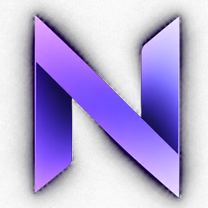

<div align="center">
  

  # Nyx

  **A browser-native, on-device hand interaction system.**

  Shape. Motion. Two hands. One interface.

  <p>
    <a href="https://nyx.example.com"><strong>Open NYX ↗</strong></a>
  </p>

  <p>
    <strong>v2.1.4</strong> · Browser-native · On-device vision · 2-hand tracking · PWA-ready
  </p>
</div>

---

## Overview

NYX is a browser-native gesture interface built around real-time hand tracking and on-device computer vision. It combines static pose recognition, motion gestures, independent left/right hand state, control surfaces, creative interaction, visual effects, mobile-first controls, session history, exports, and developer diagnostics in one focused interface.

The project is intentionally framework-free and visually authored from scratch. The goal is not to look like a generic AI dashboard; NYX is designed as a small interaction platform with a restrained, product-oriented visual system.

**Current release:** `1.0`

<a href="https://nyx.example.com"><strong>→ Open Nyx</strong></a>

---

## Highlights

- **Real-time hand tracking** with MediaPipe Gesture Recognizer.
- **Two independent hands** with separate left/right state rather than a single primary hand.
- **Static + motion gestures** including pose recognition, swipes, pinch, holds, and two-hand pinch.
- **Worker-based vision pipeline** with one-frame-in-flight back-pressure and a main-thread fallback.
- **Four interaction modes:** Recognize, Control, Playground, and FX.
- **Control surface** with index-finger cursor, hover state, and pinch-to-select interaction.
- **Creative Playground** driven by hand position, pinch forces, and two-hand interaction.
- **FX mode** with persistent fingertip trails and gesture-triggered visual bursts.
- **Mobile-first UI** with a dedicated portrait layout, safe-area support, touch-friendly navigation, and camera switching.
- **PWA support** with manifest, icons, service-worker shell caching, and install support.
- **Session tools** including history, statistics, snapshots, and JSON export.
- **Developer diagnostics** without exposing technical telemetry in the primary product surface.
- **Privacy-first behavior:** camera frames are processed in the browser; NYX has no application backend or account system.

---

## Tech Stack

NYX is built as a lightweight, browser-native application with no UI framework or third-party component library.

- HTML5 : semantic application structure and interface markup
- CSS3 : responsive layouts, mobile-first styling, animations, visual effects, and NYX's custom design system
- Vanilla JavaScript (ES Modules) : application logic, gesture processing, UI state, interactions, and session management
- Node.js : lightweight build and validation scripts
- MediaPipe Gesture Recognizer : real-time, on-device hand tracking, landmarks, handedness, and gesture recognition
- Web Workers : moves vision inference away from the main UI thread for smoother real-time interaction
- WebRTC / getUserMedia() : browser camera access and device selection
- Canvas & Browser Graphics APIs : hand visualization, trails, particles, Playground, and FX interactions


## Modes

### Recognize

The core NYX experience. View the camera feed, see the active gesture, confidence, left/right hand state, skeleton, trails, gesture history, and session statistics.

### Control

Turn your hand into a pointing device.

- Raise your index finger to move the virtual cursor.
- Hover a target to reveal the active state.
- Pinch thumb + index finger to select.
- Tiles remain mouse/touch accessible for testing and accessibility.
- Swipe gestures can move between NYX modes.

### Playground

A visual interaction field driven by hand movement.

- Open palm pushes and shapes the field.
- Pinch attracts particles.
- Two hands create a stronger central transform interaction.
- Movement is continuous instead of relying only on discrete gesture labels.

### FX

A restrained visual showcase for gesture movement.

- Fingertip trails follow hand motion.
- Pinch creates controlled bursts.
- Multiple hands produce independent visual signals.
- Reduced-motion preferences are respected.

---

## Gesture System

### Static gestures

NYX combines MediaPipe recognition with custom landmark-based classification.

| Gesture | Label |
| --- | --- |
| ✋ | HELLO / Open Palm |
| 👍 | GOOD / Thumbs Up |
| 👎 | BAD / Thumbs Down |
| ✌️ | Peace |
| ☝️ | Point / ONE |
| ✊ | Fist |
| 🤟 | I Love You |
| 👌 | OK |
| 🤘 | Rock |
| 🖐 | Three |
| 🖐 | Four |
| 🤙 | Call Me |
| 🤟 | L Shape |
| 🖕 | *** |

### Motion gestures

- Swipe Left
- Swipe Right
- Swipe Up
- Swipe Down
- Pinch
- Pinch Hold
- Fist Hold
- Two-Hand Pinch

Gesture results pass through temporal stabilization so noisy frame-to-frame classifications do not immediately become visible state changes.

---

## Interaction Model

NYX treats the camera as an input device rather than a passive viewer:

```text
Camera
  ↓
Hand landmarks
  ↓
Gesture recognizer + custom classifiers
  ↓
Temporal / motion / two-hand interpretation
  ↓
Gesture event
  ↓
Mode-specific interaction
  ├── Recognize
  ├── Control
  ├── Playground
  └── FX
```

This separation lets the same gesture engine drive different experiences without coupling each UI surface directly to MediaPipe output.

---

## Architecture

### Vision pipeline

The primary video inference path runs in a Web Worker. Camera frames are transferred into the worker with one-frame-in-flight back-pressure so the application does not build an unbounded queue of stale frames. A main-thread MediaPipe path is available as a fallback when worker video-frame transfer is unavailable.

```text
Main thread
├── Camera / video
├── UI + animation
├── Skeleton / FX rendering
├── Interaction state
└── Worker messaging
          │
          ▼
Vision worker
├── MediaPipe Gesture Recognizer
├── Hand landmarks
├── Gesture categories
└── Confidence / handedness
          │
          ▼
Gesture engine
├── Static classifiers
├── Motion detection
├── Hold / release state
├── Two-hand state
└── Temporal stabilization
```

### Project structure

```text
nyx-final-2.1.4/
├── index.html
├── manifest.json
├── sw.js
├── src/
│   ├── app.js
│   ├── style.css
│   └── vision.worker.js
├── icons/
│   ├── icon.svg
│   ├── icon-180.png
│   ├── icon-192.png
│   ├── icon-512.png
│   ├── favicon-32.png
│   ├── favicon-48.png
│   └── logo-mark.png
├── models/
├── scripts/
├── dist/
└── README.md
```

---

## Mobile Experience

NYX does not simply scale the desktop UI down to phone size.

The mobile experience has its own layout behavior:

- camera-first composition
- portrait-oriented interaction hierarchy
- safe-area-aware spacing
- floating bottom navigation
- touch-friendly controls
- front/rear camera switching where supported
- compact gesture status surfaces
- responsive mode switching
- landscape fallback behavior

The result is designed for phones held at normal selfie-camera distance rather than a desktop dashboard squeezed into a narrow viewport.

---

## Privacy

NYX requests camera access only after the user starts the camera.

Video frames are processed in the browser through MediaPipe. The project contains:

- no account system
- no NYX application backend
- no server-side camera upload path
- no database requirement for recognition

The interface intentionally describes this as **on-device vision** rather than using an opaque “AI” label.

The service worker can cache the application shell for faster repeat loading. The current release still loads the pinned MediaPipe runtime/model assets from official remote endpoints, so a completely offline installation requires self-hosting those assets as well.

---

## Controls

### Desktop keyboard shortcuts

| Key | Action |
| --- | --- |
| `Space` | Start camera |
| `Esc` | Stop camera |
| `M` | Toggle mirror |
| `O` | Toggle skeleton |
| `T` | Toggle trails |
| `S` | Snapshot |
| `F` | Fullscreen |
| `1` | Recognize |
| `2` | Control |
| `3` | Playground |
| `4` | FX |

On mobile, primary actions are surfaced through the mobile navigation and camera controls instead of relying on keyboard input.

---

## Performance

NYX includes performance presets intended to let the interface adapt to different hardware:

- **Auto** — selects an appropriate workload automatically.
- **High** — prioritizes responsiveness and visual quality.
- **Balanced** — general-purpose default behavior.
- **Battery** — reduces processing pressure for mobile or low-power hardware.

The worker pipeline also avoids processing stale frames when inference is already in progress.

---

## Accessibility & Preferences

NYX includes several usability safeguards and preferences:

- mouse/touch fallback for Control targets
- reduced-motion support
- optional gesture trails
- optional skeleton visualization
- optional sound feedback
- visible recognition confidence
- state feedback for hover, selection, and active gesture transitions

---

## Exports & Session Tools

NYX can retain recognition history for the active session and expose session-level information such as:

- recognized gesture events
- unique gestures
- two-hand events
- confidence information
- recent gesture timeline

Sessions can be exported as JSON, and camera snapshots can be captured from the active interface.

---

## References

The project architecture and interaction direction were informed by the following public references:

- [Google AI Edge — MediaPipe Gesture Recognizer for Web](https://ai.google.dev/edge/mediapipe/solutions/vision/gesture_recognizer/web_js)
- [MediaPipe Web Samples](https://github.com/google-ai-edge/mediapipe-samples-web)
- [Current MediaPipe Gesture Recognizer sample](https://github.com/google-ai-edge/mediapipe-samples-web/blob/main/src/tasks/gesture-recognizer.ts)
- [Web AR Hand Tracking with MediaPipe in a Web Worker](https://github.com/damiansire/web-ar-hand-tracking)
- [HandCanvas gesture interaction reference](https://github.com/malik-builds/HandCanvas)
- [HandCam-Control configurable gesture/action mapping](https://github.com/fikriaf/HandCam-Control)
- [Gesture particles](https://github.com/Wlarskog/gesture-particles)
- [Gesture Canvas](https://github.com/walecjccc/gesture-canvas)

---

## License

MIT LICENSE

## Author

**Mikael Kalesaran**